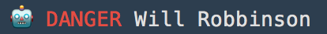

# parse-ansi

> 🤖  Parse ansi into an array of ansi-tags and text-chunks.

[](https://travis-ci.org/F1LT3R/parse-ansi)
[](https://coveralls.io/github/F1LT3R/parse-ansi?branch=master)
[](https://www.npmjs.com/package/@f1lt3r/parse-ansi)
[](https://github.com/sindresorhus/xo)

Parse-ANSI takes an ANSI string as input:

```plain
const text = "🤖\u001B[31m DANGER\u001B[0m Will Robbinson"
console.log(text)
```



When you run your text through the ANSI parser...

```js
const parseAnsi = require('parse-ansi')
const parsed = parseAnsi(text)
console.log(parsed)
```

...Parse-ANSI outputs value, position and style data.

```js
{
    raw: '🤖\u001B[31m DANGER\u001B[0m Will Robbinson',    
    plain: '🤖 DANGER Will Robbinson',
    textArea: {columns: 24, rows: 1},
    chunks: [{
        type: 'text',
        value: '🤖',
        position: {x: 0, y: 0, n: 0, raw: 0},
        style: {}
    }, {
        type: 'ansi',
        value: {tag: 'red', ansi: '\u001b[31m'},
        position: {x: 2, y: 0, n: 2, raw: 2}
    }, {
        type: 'text',
        value: ' DANGER',
        position: {x: 2,y: 0,n: 2, raw: 7},
        style: {
            foregroundColor: 'red'
        }
    }, {
        type: 'ansi',
        value: {tag: 'reset', ansi: '\u001b[0m'},
        position: {x: 9, y: 0, n: 9, raw: 14}
    }, {
        type: 'text',
        value: ' Will Robbinson',
        position: {x: 9, y: 0, n: 9, raw: 18},
        style: {}
    }]
}
```

This data can be used to convert ANSI sequences to other formatsm such as HTML, Image, SVG, etc.

## Chunk

Each object in the output array is called a "chunk". Each chunk represents one or more of the following data types.

1. `ansi` - ANSI escape sequence
1. `newline` - Newline character
1. `text` - Text chunk of like-styles

## Style

The style object contains a list of styles associated with the current chunk. Each style represents an ANSI Escape sequence that is mapped to  friendly name called an `ANSI-Tag`.

- Styles are only included in text chunks.
- Styles that are off/closed, are not present in the style object. 

The following style object describes a chunk of red text:

```js
{
    foregroundColor: 'red'
}
```

This object shows alls styles in combination:

```js
{
    backgroundColor: 'bgRed',
    foregroundColor: 'white',
    dim: true,
    bold: true,
    italic: true,
    underline: true,
    strikethrough: true,
    inverse: true
}
```

Styles that are closed or reset are not included in the style object. 

For example:

```js
             // Turn on Bold
const text = '\u001b[1m BOLD' +
    // Turn off all styles
    '\u001b[0m NORMAL'

const parsed = parseAnsi(text)

const styles = parsed
    .filter(chunk => chunk.style)
    .map(chunk => chunk.style)

console.log(styles)
```

The above code should log:

```js
[
    // Turn on Bold
    { bold: true },

    // Turn off all styles
    {}
]
```

## Position

```js
{x: 2, y: 0, n: 2, raw: 2}
```

The position object contains 4 kinds of position:

1. `x` - Plain-text column at which the chunk starts
1. `y` - Plain-text crow at which the chunk starts
1. `n` - Linear, 1-dimensional plain-text position at which the chunk starts.
1. `raw` - Linear 1-dimensional position at which the chunk starts for ANSI or plain-text. This is the real JavaScript position string position of the chunk.

## Value

### Text Value

The value of a `text` chunk is a JavaScript string. The value of a text chunk should never contain any ANSI escape sequences.

```js
{
    type: 'text',
    value: ' DANGER',
}
```

### ANSI Value

The value of an `ansi` chunk is an object. 

- `value.tag` - Friendly-named ansi-tag.
- `value.ansi` - Raw ANSI string value.

```js
{
    type: 'ansi',
    value: {
        tag: 'red',
        ansi: '\u001b[31m'
    }
}
```

You can find the list ansi-tags in [types/types.ansi-seqs-to-ansi-tags.js](types/types.ansi-seqs-to-ansi-tags.js).

## Install

```
$ yarn add parse-ansi
```
